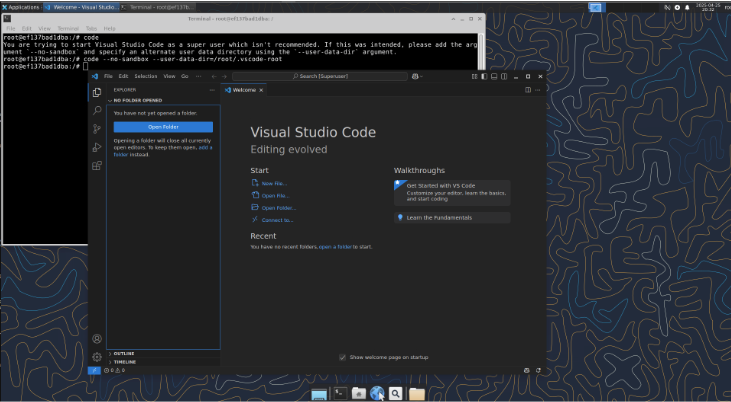

####################################

Introducción

####################################

Con este contenedor tendrás un entorno de desarrollo gráfico en un contenedor Ubuntu 24.04 al que podrás acceder mediante SSH o VNC.

Se instalará:

-Entorno gráfico XFCE
-Servidor VNC TigerVNC
-Python
-Visual Studio Code
-SSH

####################################

Instrucciones paso a paso

####################################

En tu máquina con Docker, procede a crear un directorio con el que trabajaremos.

`mkdir dockera2 `

Dentro de este directorio descarga o copia y pega los archivos del repositorio

“Dockerfile”
“start.sh”

Una vez tengas los archivos, desde el directorio ejecuta el siguiente comando para construir el contenedor, donde “xfce-vnc” puede ser substituido por el nombre que le quieras dar al contenedor

`docker build -t xfce-vnc . `

Este proceso, que puede demorar unos minutos, descargará los archivos y dependencias indicadas en el Dockerfile y al acabar ejecutará los comandos que hay en “start.sh”, una vez finalizado deberías ver algo así:

Ahora ejecuta este comando para iniciar el contenedor, que mapeará los puertos correctamente, es decir ssh al contenedor en “2222”(el 22 lo puedes necesitar para tu máquina virtual) y 5901 para el servicio VNC.

`docker run -d --name xfce-container -p 2222:22 -p 5901:5901 ubuntu-xfce`

Deberías ver un código identificador del contenedor si todo se ha creado correctamente.

Listo, nuestro contenedor ya está preparado. Ahora vamos a ver como acceder y utilizarlo.

####################################

Cómo acceder en modo CLI

####################################

Para acceder mediante ssh simplemente ejecuta el siguiente comando en tu terminal, donde la ip deberás cambiarla por la de tu máquina Docker.

`ssh root@<IP> -p 2222 `
Si todo ha funcionado deberías ver algo así en tu terminal:

Con el parámetro -p 2222 especificamos el puerto que hemos mapeado al ssh del contenedor.

En caso de utilizar una máquina en modo NAT deberás indicar la dirección localhost y configurar el Port Forwarding en VirtualBox como indica la imagen.

No es recomendado utilizar el usuario root para usar el entorno, una vez tengas tu propio contenedor te aconsejo ENCARECIDAMENTE que crees tu nuevo usuario normal.

Ya estás listo para utilizar tu contenedor en modo terminal

####################################

Cómo acceder en modo gráfico

####################################

Descarga una herramienta de visionado VNC para tu sistema operativo.
Recomiendo TigerVNC que es multiplataforma, sencillo de instalar y utilizar

TigerVNC (https://tigervnc.org/)

Ejecuta tu visor de VNC e introduce la IP de tu máquina docker junto al puerto VNC que hemos mapeado separado por “:”.

Al pulsar “Connect” deberías ver tu contenedor con entorno gráfico listo para usarse.

Para comprobar que python se ha instalado correctamente invoca el comando “python3” en la terminal

Ahora deberías de poder acceder a VSC, como he mencionado anteriormente te aconsejo crear un usuario y no utilizar root, pero para para comprobar que todo funciona correctamente como root utiliza el comando:

`code --no-sandbox --user-data-dir=/root/.vscode-root`

Deberías ver algo así:

Al crear un archivo “.py” VSC mostrará una notificación para instalar el plugin que te permitirá usar Python, sino es así puedes buscarlo manualmente escribiendo “python” en el buscador de plugins.

Una vez instalado, ya estás listo para trabajar con VSC y Python.

Happy coding!

